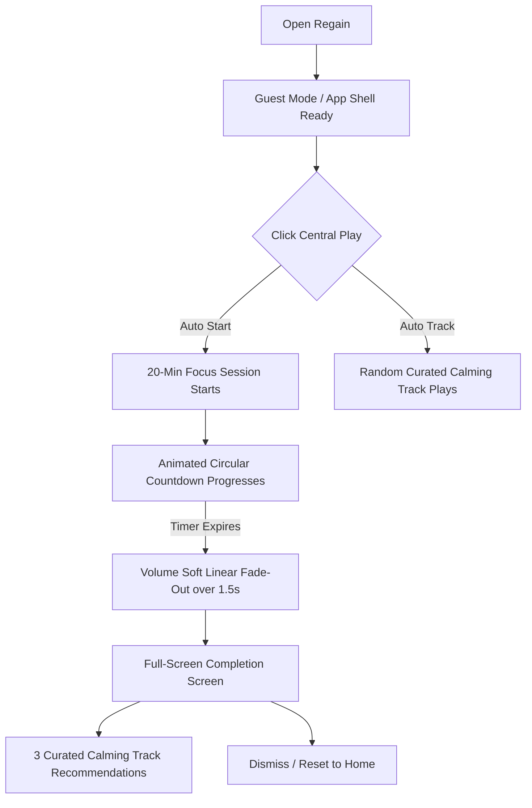
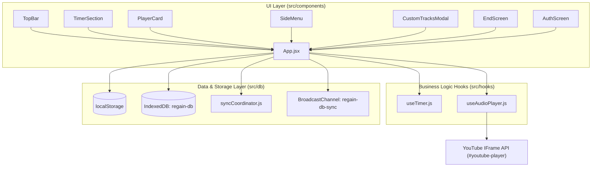

# Regain — Product Requirements Document (PRD) & Technical Specification

> **Version:** 1.0  
> **Status:** Active  
> **Type:** Master Specification (Product Vision, UX, & Technical Architecture)

---

## 1. Product Vision & Positioning

### 1.1 Product Vision
**Regain** is a minimal focus companion Progressive Web App (PWA) engineered to eliminate decision fatigue and guide users into a calm, focused state within seconds.

The app feels emotionally light, visually quiet, and mentally non-demanding. Every interaction reduces friction rather than introducing another productivity system the user has to manage.

* **It is not a productivity dashboard or a complex streaming platform.**
* **It is a lightweight focus ritual and a calming entry point into focused work.** Music is simply the vehicle into that state.

### 1.2 Core Product Principles
When someone opens the app, they are often mentally overloaded, scattered, or distracted. The interface strictly adheres to the following principles:
* **Reduce Thinking**: No mandatory decisions required to start.
* **Reduce Choices**: Play starts immediately with a curated calming soundscape.
* **Reduce Movement & Visual Noise**: Clean, breathable, luxury minimal layout where the timer dominates attention.
* **Encourage Immediate Action**: "One click to focus."

---

## 2. User Journey & Core Experience Flows



### 2.1 Primary Focus Flow
1. **User Opens the App**:
   - Large visual radial timer is immediately centered and visible.
   - A single prominent central play button commands attention.
   - Background and interface are visually quiet with soft glassmorphic styling.
2. **User Clicks Play**:
   - Begins the default 20-minute focus session.
   - Automatically plays a random calming ambient track (no browsing needed).
   - Starts smooth radial progress depletion animation.
3. **During Focus**:
   - Non-intrusive floating music control pill collapses automatically after 8 seconds of inactivity.
   - Subtle controls allow pausing or adjusting duration (±5 mins) without cognitive strain.
4. **Session Completion**:
   - Audio fades out gently over 1.5 seconds.
   - Full screen transitions smoothly into a rewarding completion state featuring a warm smiling indicator.
   - Presents 3 recommended calming soundscape cards to sustain calm or restart.
   - Clean, non-intrusive close button to return to home without productivity guilt or streak pressure.

---

## 3. UI Layout & Component Specifications

### 3.1 Hero Focus Area
* **Dominant Focus**: Centered radial progress timer with circular depletion animation.
* **Progress Visualization**: Pie-chart / smooth SVG radial time depletion so users sense remaining time without constant numeric parsing.
* **Primary CTA**: Central play/pause trigger with clear visual state.
* **Timer Adjustment**: Subtle `+5m` and `-5m` adjustment controls when paused. Default session length: 20 minutes.

### 3.2 Music Playback & Track Info
* **Zero-Friction Default**: Automatically selects and streams a curated track on play.
* **Floating Player Pill (`PlayerCard.jsx`)**:
  - Displays current track title and category.
  - Controls: Play/Pause, Next Track, Previous Track, Soundscape Picker toggle.
  - **Self-Collapsing Watchdog**: Auto-collapses to a compact pill after 8 seconds of inactivity. Resets timer on user interaction.

### 3.3 Soundscape Catalog & Custom Ingestion
* **Category Cards**: Calm visual cards placed below the fold (Deep Focus, Rain + Piano, Ambient Space, Nature Calm, Soft Lo-Fi, White Noise, Meditation Focus).
* **Browsing Flow**: Clicking a category opens a lightweight glassmorphic modal with track lists.
* **Custom YouTube Soundscapes (`CustomTracksModal.jsx`)**:
  - Allows users to paste valid YouTube URLs.
  - Automatically parses video IDs, persists them in IndexedDB, and enables immediate playback.

### 3.4 Design Language & Aesthetic
* **Luxury Minimal & Glassmorphism**: High background blurs (`backdrop-filter: blur(24px)`), translucent HSL/RGBA tokens, smooth border highlights.
* **Typography**: Clean sans-serif typography (Inter / Outfit) with calm, breathable spacing.
* **Themes**: Seamless Light and Dark mode switching powered by CSS Custom Properties (`[data-theme="light"]`).
* **Emotional Atmosphere**: Evokes a quiet room, a mindful pause before deep work, emotional decompression, and mental clarity.

### 3.5 Features Explicitly Avoided
To protect focus quality and mental calm, the following are strictly excluded:
* Push notifications & intrusive interruptions.
* Social feeds, likes, comments, and public sharing loops.
* Gamification pressure (punitive streaks, rank boards, guilt-inducing analytics).
* Cluttered settings dashboards and endless algorithmic feeds.

---

## 4. Technical Architecture & Tech Stack



### 4.1 Tech Stack
* **Framework & Build Tool**: React 18 (`^18.3.1`), Vite (`^5.3.1`).
* **Styling**: Pure vanilla CSS ([`src/index.css`](file:///D:/PROJECTS/AIT%20Projects/AIT%20Vibe%20Project%20Ideas/Regain/src/index.css)) utilizing CSS Custom Properties and glassmorphic tokens. No heavyweight UI libraries or utility frameworks.
* **Audio Engine**: Headless YouTube IFrame Player API anchored in an off-screen container (`#youtube-player`).
* **Client Storage**:
  * `localStorage`: Transient UI preferences, theme selection, custom timer presets.
  * `IndexedDB` (`regain-db`): Custom user soundscapes and metadata via `SoundscapeDB`.
* **PWA & Offline Lifecycle**: `vite-plugin-pwa` with Workbox auto-updating service worker lifecycle.
* **Multi-Tab Sync**: Web `BroadcastChannel` API (`regain-db-sync`).

---

## 5. Directory & File Structure

```
Regain/
├── src/
│   ├── components/
│   │   ├── AuthScreen.jsx         # Guest / zero-friction gating screen
│   │   ├── CustomTracksModal.jsx  # YouTube URL ingestion modal
│   │   ├── EndScreen.jsx          # Session completion & recommendations
│   │   ├── Modal.jsx              # Reusable glassmorphic modal container
│   │   ├── PlayerCard.jsx         # Collapsing 8s inactivity player pill
│   │   ├── ReloadPrompt.jsx       # Service worker update notification toast
│   │   ├── SideMenu.jsx           # Slide drawer: settings, category links, install CTA
│   │   ├── TimerSection.jsx       # SVG radial countdown & primary CTA
│   │   └── TopBar.jsx             # Header & light/dark theme toggle
│   ├── data/
│   │   └── categories.js          # Curated soundscapes & categories catalog
│   ├── db/
│   │   ├── soundscapeDb.js        # IndexedDB CRUD wrapper (regain-db)
│   │   └── syncCoordinator.js     # Guest-to-cloud migration coordinator
│   ├── hooks/
│   │   ├── useAudioPlayer.js      # YouTube IFrame bridge & self-healing watchdog
│   │   └── useTimer.js            # Countdown loop, progress, and ±5m adjuster
│   ├── App.jsx                    # Root state coordinator
│   ├── index.css                  # Monolithic design system & glassmorphism
│   └── main.jsx                   # React root entry point
├── public/
│   └── icons/                     # PWA icon assets (192px, 512px, SVG)
├── index.html                     # HTML shell, font preloads, YT API hint
├── vite.config.js                 # Vite + PWA Workbox configuration
├── PRD.md                         # Master Product Requirements & Architecture Doc
└── package.json
```

---

## 6. Subsystem Specifications

### 6.1 Audio Engine (`useAudioPlayer.js`)
* **Off-Screen DOM Anchor**: Injects the YouTube player into `<div id="youtube-player"></div>` styled with `position: absolute; top: -9999px`.
* **Bandwidth Optimization**: Programmatically sets playback quality to `player.setPlaybackQuality('small')`.
* **Smooth Volume Fade**: Linearly decrements volume across 10 steps over 1.5 seconds upon session completion.
* **Defensive Watchdogs**:
  1. *Late-Mounted DOM Container*: Detects late insertion of `#youtube-player` when bypassing `AuthScreen`.
  2. *2.5s Autoplay Stall*: Auto-skips tracks blocked by browser autoplay policies.
  3. *30s Timeout & Error Interceptor*: Intercepts YouTube error codes `2, 5, 100, 101, 150` to skip restricted or deleted tracks automatically.

### 6.2 Timer Engine (`useTimer.js`)
* Manages precise 1-second interval ticks.
* Computes normalized fractional progress: `progress = (duration - timeLeft) / duration`.
* SVG Radial progress computation: `strokeDashoffset = circumference * (1 - progress)` with `radius = 48` (`circumference ≈ 301.59`).
* Provides live `±5 min` adjustments when paused.

### 6.3 Local-First & Cloud-Ready Data Model (`soundscapeDb.js` + `syncCoordinator.js`)
* All custom tracks stored in IndexedDB under store `custom-tracks` with schema:
  ```ts
  {
    id: string,          // YouTube 11-char Video ID
    title: string,
    artist: string,
    duration: number,    // Seconds
    categoryId: string,  // Target parent category
    isCustom: true,
    userId: 'guest' | string,
    synced: boolean,
    addedAt: number
  }
  ```
* **Storage Persistence**: Requests `navigator.storage.persist()` on database initialization.
* **Cross-Tab Synchronization**: Database mutations trigger a `SYNC_CUSTOM_TRACKS` broadcast across open tabs via `BroadcastChannel('regain-db-sync')`.

### 6.4 Progressive Web App (PWA) & Offline Strategy
* Custom install prompt trigger accessible across mobile and desktop.
* Cache-first / Network-first Workbox strategy for static assets, scripts, styles, and curated catalog definitions.
* UI includes skeleton loading and offline fallback states for graceful degradation when network connectivity fluctuates.

---

## 7. Critical Invariants & Developer Rules

> [!IMPORTANT]
> 1. **Do not remove the late-mounted watchdog in `useAudioPlayer.js`**:
>    Because `AuthScreen.jsx` conditionally unmounts the app shell until guest login, `#youtube-player` is not initially present in the DOM. Removing the DOM observer watchdog will cause silent playback initialization failure.
> 2. **Maintain Local-First Schema Flags**:
>    Always ensure any database writes through `SoundscapeDB` populate `userId` (default `'guest'`) and `synced` (`false`), enabling clean migration by `SyncCoordinator.migrateGuestDataToCloud()`.
> 3. **Preserve CSS Variable Scoping**:
>    Styling relies exclusively on CSS custom properties defined in `:root` and `[data-theme="light"]` in [`src/index.css`](file:///D:/PROJECTS/AIT%20Projects/AIT%20Vibe%20Project%20Ideas/Regain/src/index.css). Do not hardcode hex values into component inline styles without using tokens.
> 4. **Defensive Modal & State Handling**:
>    Ensure modal transitions (e.g., soundscapes lists) include robust fallback null-checks (e.g., checking if `selectedModalCategory` is null) to prevent React DOM tree unmount crashes.

---

## 8. Future Backend Integration Guide

To connect a cloud backend (e.g., Supabase, Firebase, or Node REST API):
1. Replace simulated delay in [`src/db/syncCoordinator.js`](file:///D:/PROJECTS/AIT%20Projects/AIT%20Vibe%20Project%20Ideas/Regain/src/db/syncCoordinator.js) with real API requests.
2. When a user authenticates in [`src/components/AuthScreen.jsx`](file:///D:/PROJECTS/AIT%20Projects/AIT%20Vibe%20Project%20Ideas/Regain/src/components/AuthScreen.jsx), trigger:
   ```javascript
   await SyncCoordinator.migrateGuestDataToCloud(authenticatedUserId);
   ```
3. Call `SyncCoordinator.syncSingleTrack(track, userId)` inside [`src/components/CustomTracksModal.jsx`](file:///D:/PROJECTS/AIT%20Projects/AIT%20Vibe%20Project%20Ideas/Regain/src/components/CustomTracksModal.jsx) upon adding custom tracks when authenticated.

---

## 9. Development & Build Commands

```bash
# Start local development server
npm run dev

# Production build (bundles React + generates PWA Service Worker)
npm run build

# Preview production build locally
npm run preview
```
